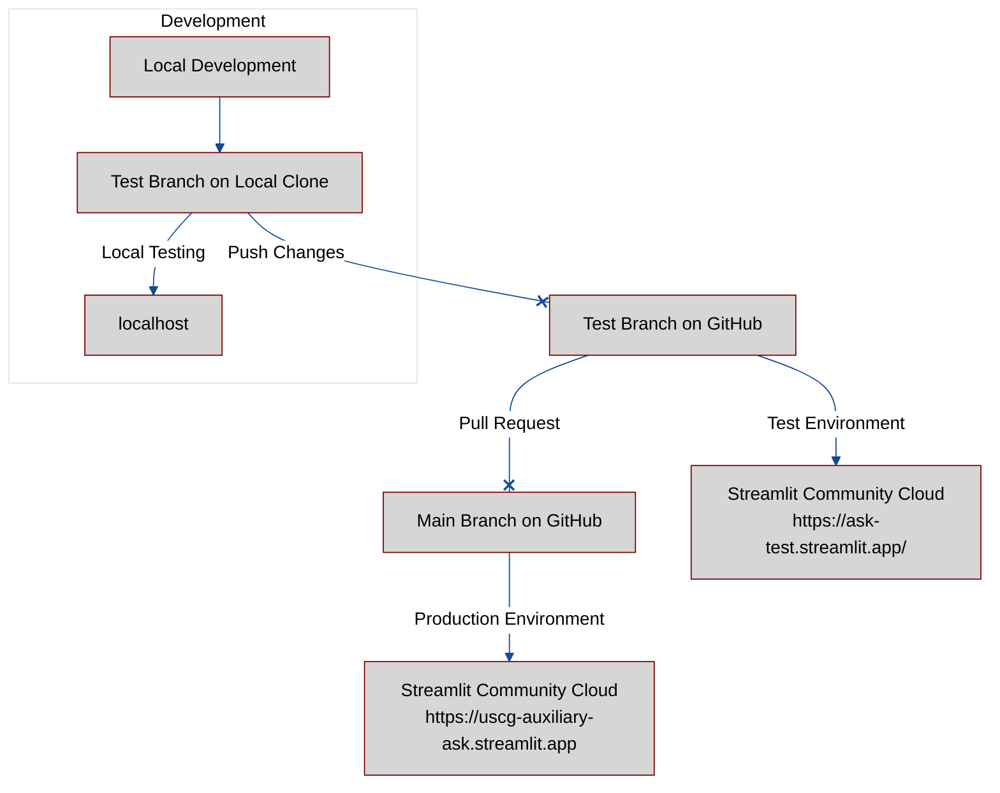

## ASK Project Development Workflow

```mermaid
%%{
  init: {
    'theme': 'base',
    'themeVariables': {
      'primaryColor': '#CCCC',
      'primaryTextColor': '#000',
      'primaryBorderColor': '#7C0000',
      'lineColor': '#0E4C92',
      'secondaryColor': '#FFFFFF',
      'tertiaryColor': '#fff'
    }
  }
}%%
graph TD
    subgraph Development
    A[Local Development] --> B[Test Branch on Local Clone]
    B -->|Local Testing| L[localhost]
    end
    B --x |Push Changes| C[Test Branch on GitHub]
    C --x |Pull Request| F[Main Branch on GitHub]
    F --> |Production Environment| G[Streamlit Community Cloud<BR>https://uscg-auxiliary-ask.streamlit.app]
    C --> |Test Environment| D[Streamlit Community Cloud<BR>https://ask-test.streamlit.app/]
```

